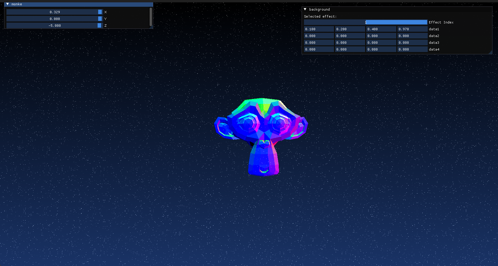

A C++ and Graphics learning project

## Compute Shaders + ImGuI

### Commit 62: d6da810f1be7025b276ede2a62809be3e5de3579

### Commit 69: 48ce7a1107a8b3a2b8678e1b74615d57f89e644d

## Commit 84: 7150e17d2d7084f8e92b4b08748afeb8e6c36ba8

## Commit 94: 9490d144b9ba82b59e623932aeee39f2fffef07b

